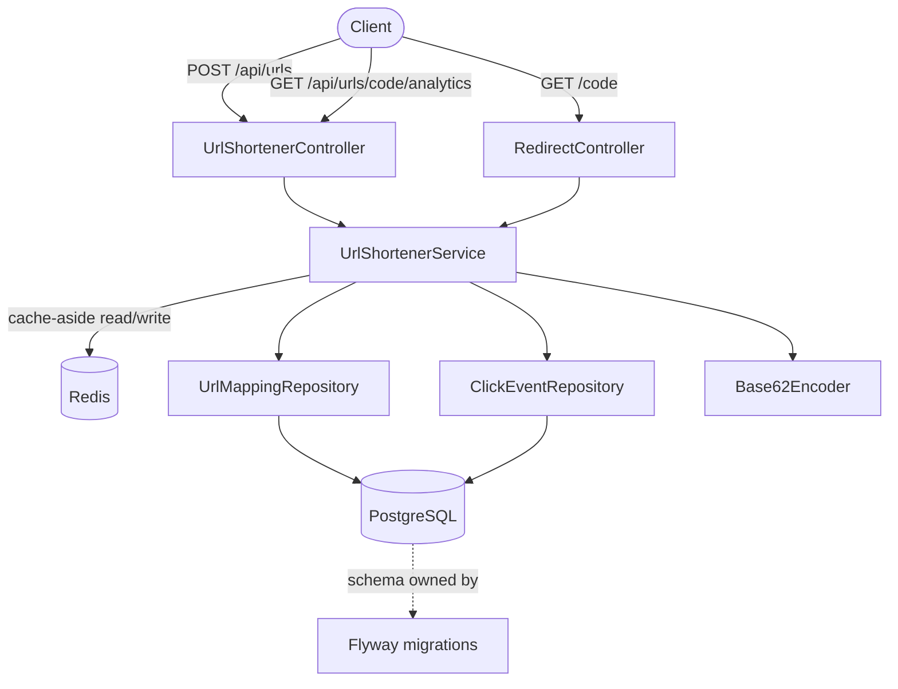

# Architecture

## Components

- **Controllers** — thin HTTP layer; no business logic. `UrlShortenerController`
  handles creation + analytics reads. `RedirectController` handles the hot path
  (`GET /{code}`) and is deliberately the simplest, fastest code path in the app.
- **`UrlShortenerService`** — all business logic: short-code assignment, cache-aside
  reads, async click recording, analytics aggregation.
- **`Base62Encoder`** — pure, stateless conversion between DB auto-increment IDs and
  short codes. No I/O, fully unit-testable in isolation.
- **Repositories** — Spring Data JPA interfaces; `incrementClickCount` is a hand-written
  atomic `UPDATE` rather than a derived method, specifically to avoid a
  read-modify-write race under concurrent redirects of the same link.
- **Redis** — cache-aside, not cache-through. The app can always fall back to Postgres
  if Redis is unavailable; Redis is never the sole source of truth for a URL mapping.
- **PostgreSQL + Flyway** — Flyway migrations (`src/main/resources/db/migration`) are
  the single source of truth for schema; `ddl-auto: validate` makes Hibernate confirm
  entity mappings agree with the migrated schema at startup rather than silently
  creating/altering tables.

> **Why there are two migration files for one column.** `V2__add_click_count_column.sql`
> looks redundant next to `V1__init_schema.sql`, which already creates `click_count`
> directly. That's real history, not a mistake left uncleaned: the app originally failed
> to start with a schema-validation error (`click_count` existed on the JPA entity but
> not in the database), `V2` was written to fix it live, and `V1` was separately
> corrected afterward so a fresh database wouldn't need the patch at all. `V2` is left
> in place rather than deleted, because rewriting an already-applied migration's content
> changes its Flyway checksum and breaks validation for any environment that already ran
> it — the correct fix for an applied migration is always a new migration, never an edit
> to the old one, even when the old one looks unnecessary in hindsight.

## Control flow: redirect (the hot path)

1. `GET /{code}` hits `RedirectController`.
2. `UrlShortenerService.getOriginalUrl(code)` checks Redis first (`url:{code}` key).
3. **Cache hit** → return immediately, no DB round-trip.
4. **Cache miss** → query Postgres by `short_code`; check `active` and `expires_at`;
   repopulate Redis on success.
5. Regardless of hit/miss, click recording (`recordClick`) runs `@Async` — the redirect
   response is returned to the client before the click-count increment and
   `click_events` insert complete. A slow or failing analytics write never delays or
   breaks the redirect itself.

## Key decisions and trade-offs

| Decision | Why | Trade-off accepted |
|---|---|---|
| Base62(sequential ID) instead of random codes | Simpler: no collision retry loop needed, uniqueness is free from the DB's auto-increment | **Short codes are enumerable** — id=1 → code `1`, id=2 → code `2`, etc. Anyone can walk sequential codes and discover every link in the system. Acceptable for this prototype's scope; **not** acceptable as-is if links are ever meant to be unguessable/private. Documented here rather than silently shipped. |
| Cache-aside (not cache-through) | System keeps working (degraded latency, not degraded correctness) if Redis is down | An extra DB read on every cache miss; slightly more complex than a single source of truth |
| Async click recording, isolated from the redirect response | A user must never see a failed/slow redirect because analytics logging had a problem | Click counts are eventually consistent — a crash between the redirect response and the async write completing loses that one click event. Acceptable for analytics; would not be acceptable if click count were used for anything transactional (e.g. billing) |
| `ddl-auto: validate` + Flyway migrations | Single source of truth for schema, fails fast on drift instead of silently auto-altering tables in "production" | Requires every schema change to go through a new migration file — slower than `update` for quick local iteration, which is the correct trade for anything beyond a throwaway prototype |

## Known limitations (intentionally not fixed in this pass)

- **No rate limiting** on `POST /api/urls` or `GET /{code}`. A scripted client could
  create unlimited short URLs or hammer the redirect endpoint. Flagged as the primary
  gap in "reliability features" — see `SCENARIOS.md` Scenario 3.
- **No circuit breaker around Redis.** A Redis timeout on the read path currently
  propagates as a slower/failed request rather than gracefully degrading straight to
  Postgres.
- **No custom alias support** — short codes are always system-generated.
- **No endpoint to deactivate/delete a link** post-creation (the `active` column
  exists in the schema and is checked on read, but nothing currently sets it to
  `false`).
- **Raw IP addresses stored in `click_events`** with no hashing — a privacy
  consideration if this data were ever exported or exposed beyond internal analytics.
- **CI has not been confirmed against a live GitHub Actions run.** The workflow has
  been pushed to `main` and is written to run the same `mvn verify` that's been
  confirmed locally (14/14 tests passing, see `AI_TRACEABILITY.md`), but the Actions
  run itself hasn't been checked. Confirm the green checkmark on GitHub before
  treating CI as validated end-to-end — local success and CI success aren't
  automatically the same thing (different OS, no local Docker daemon quirks, etc.).
